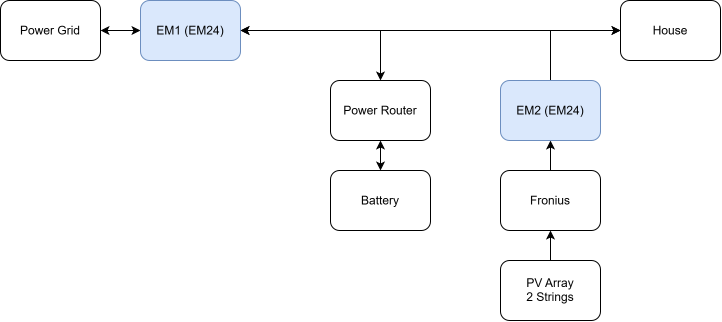
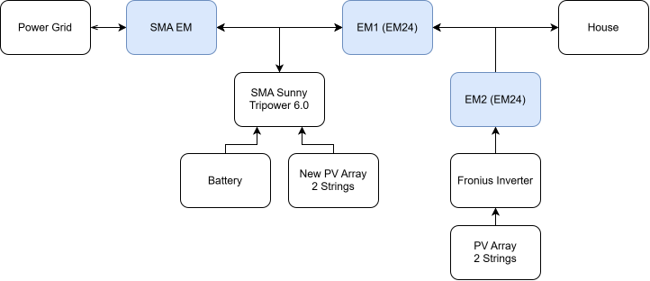
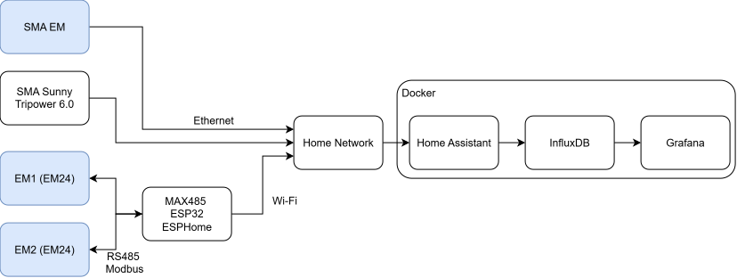
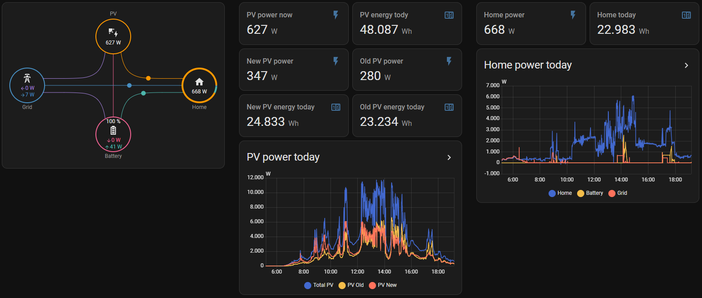

# Solar Energy Monitoring

A monitoring system for a mixed SMA and Fronius solar installation using Carlo Gavazzi EM24 energy meters, an ESP32, RS485 Modbus RTU, ESPHome, Home Assistant, and InfluxDB.


## Project goals

- Read two existing EM24 meters over a shared RS485 bus
- Publish live power measurements through ESPHome
- Integrate EM24 and SMA measurements into Home Assistant
- Store long-term measurements in InfluxDB
- Calculate and compare energy flows across the installation


## Original system

The original system used a Fronius Symo 8.2-3-M solar inverter and a Nedap PowerRouter.
The PowerRouter managed the battery and collected measurements from two Carlo Gavazzi EM24 energy meters.




## New system

After the original monitoring service was discontinued and the PowerRouter battery system failed, the installation was upgraded with an SMA Sunny Tripower 6.0 and a BYD Battery HVS 5.1. The battery consists of two 2.56 kWh HVS modules.
The upgrade also extended the solar array.

The positions of the existing EM24 meters were not changed during the upgrade, resulting in the system layout shown below. An ESP32 now provides an independent interface to both EM24 meters using RS485 Modbus RTU.




### PV array overview
The current installation combines the original Fronius-connected array with an additional array connected to the SMA system. There is no significant external shading, although the roof geometry and chimney cause minor temporary shading.

| Array | Modules | Orientations | Approximate capacity |
| --- | ---: | --- | ---: |
| Original Fronius array | 30 | West and south | 7.6 kWp |
| Added SMA array | 18 | East and south | 8.1 kWp |
| Combined installation | 48 | East, south, and west | 15.7 kWp |


## Monitoring architecture

The ESP32 reads both EM24 meters and publishes their measurements through ESPHome. Home Assistant combines these readings with data from the SMA system, while InfluxDB provides long-term storage.




## Home Assistant dashboard
The dashboard combines live power measurements from both PV systems with household consumption, grid exchange and battery data. Integral and Utility Meter helpers provide the daily energy values.



## Hardware

| Component | Purpose |
| --- | --- |
| ESP32 development board | Runs ESPHome |
| MAX485CSA RS485 transceiver | Connects the ESP32 to the RS485 bus |
| Carlo Gavazzi EM24, addresses 1 and 2 | Measures electrical power and energy |
| SMA Sunny Tripower 6.0 | Hybrid inverter for the PV array and battery |
| BYD Battery HVS 5.1 | Battery consisting of two 2.56 kWh HVS modules |
| Fronius Symo 8.2-3-M | Inverter for the existing PV array |

> [!WARNING]
> The current prototype uses a MAX485CSA+ transceiver powered from 3.3 V,
> although the device is specified for a 5 V supply. The final design should use
> a 3.3 V-compatible transceiver such as the MAX3485.

### EM24 registers

| Measurement | Start address | Registers | Raw Modbus format | Scale |
| --- | ---: | ---: | --- | ---: |
| Total active power (L1 + L2 + L3) | `0x0028` | 2 | Signed 32-bit integer, LSW first | `0.1 W` |
| Imported active energy | `0x003E` | 2 | Unsigned 32-bit integer, LSW first | `0.1 kWh` |
| Exported active energy | `0x005C` | 2 | Unsigned 32-bit integer, LSW first | `0.1 kWh` |

Power is signed because its direction can change. The sign associated with
import and export depends on the installation and meter orientation. Cumulative
energy counters are unsigned.


### ESP32 to MAX485
The ESP32 communicates with both EM24 meters through one shared half-duplex RS485 bus. ESPHome controls the transmitter direction using GPIO4. The ESP32 is powered through USB.

| ESP32 | MAX485 | Purpose |
| --- | --- | --- |
| GPIO17 (`TX`) | `DI` | Data transmitted from the ESP32 |
| GPIO16 (`RX`) | `RO` | Data received by the ESP32 |
| GPIO4 | `DE` and `/RE` connected together | Transmit/receive direction control |
| GND | GND | Low-voltage signal reference |
| 3.3V | VCC | Transceiver power supply (outside the specification) |
| - | A | RS485 bus A |
| - | B | RS485 bus B |

#### Electrical notes

- `DE` and `/RE` are connected to GPIO4, allowing the ESP32 to switch between transmit and receive mode.
- The ESP32 is the only Modbus RTU master. Each EM24 must have a unique slave address, while all devices use the same baud rate, parity and number of stop bits.
- If the RS485 polarity is unknown, an oscilloscope can help identify the inverting and non-inverting lines. Swapping the two data lines while powered down is also a normal troubleshooting step.
- A 120 Ω termination resistor may be required at each physical end of the bus. Check whether the transceiver or meter already provides termination.
- `GND` refers to the low-voltage signal reference, not protective earth.


## Software
| Component | Purpose |
| --- | --- |
| ESPHome | Reads both EM24 meters over Modbus RTU and publishes their measurements |
| Home Assistant | Combines EM24 and SMA data, calculates derived values, and provides dashboards |
| InfluxDB | Stores selected measurements for long-term analysis |

The EM24 measurements are sent to Home Assistant through the ESPHome native API.
The complete [ESPHome configuration](esphome/em24-solar.yaml) is included in this repository.


### Home Assistant

The project uses the following Home Assistant integrations:

- **ESPHome** for measurements from the two EM24 meters
- **SMA Solar** for inverter, battery, and SMA Energy Meter data
- **InfluxDB** for long-term storage

Data from the SMA inverter, battery, and SMA Energy Meter is collected using the Home Assistant **SMA Solar** integration.

Copy the provided
[Home Assistant package](home_assistant/packages/solar_energy_monitoring.yaml)
to:

```text
/config/packages/solar_energy_monitoring.yaml
```

Enable packages in `configuration.yaml`:

```yaml
homeassistant:
  packages: !include_dir_named packages
```

and add the InfluxDB token to the private Home Assistant `secrets.yaml` file:
```yaml
influxdb_token: "YOUR_INFLUXDB_TOKEN"
```

#### Energy helpers

The template sensors provide instantaneous power in watts. To calculate
cumulative energy in kilowatt-hours, create two **Integral** helpers through:

**Settings → Devices & services → Helpers → Create helper → Integral**

| Helper name | Input sensor | Metric prefix | Integration time | Method |
| --- | --- | --- | --- | --- |
| Total PV Energy | `sensor.total_pv_power` | `k` | Hours | Trapezoidal |
| Total House Energy | `sensor.house_power_consumption` | `k` | Hours | Trapezoidal |

These helpers convert the power measurements from W to cumulative kWh.

Daily counters can then be created using **Utility Meter** helpers through:

**Settings → Devices & services → Helpers → Create helper → Utility Meter**

| Helper name | Input sensor | Reset cycle |
| --- | --- | --- |
| Daily PV Energy | `sensor.total_pv_energy` | Daily |
| Daily House Energy | `sensor.total_house_energy` | Daily |


> **Note:**
> The Integral and Utility Meter helpers are currently created through the Home
> Assistant user interface and are therefore not included directly in the
> configuration package. They must be added manually after installing the
> package.


## Current implementation

ESPHome reads the total active power from both EM24 meters. Home Assistant combines these measurements with data from the SMA Solar integration to calculate total PV power and household consumption.

Integral helpers convert the calculated power measurements into cumulative
energy, while Utility Meter helpers provide daily counters.
The individual devices are sampled independently and their measurements are not time-synchronized. During fast changing conditions, such as passing clouds, production can change significantly between samples. Combining values from different meters can therefore cause the calculated household consumption to briefly appear negative.

Directly reading the cumulative imported and exported energy registers from the EM24 meters is planned but is not yet part of the stable configuration.